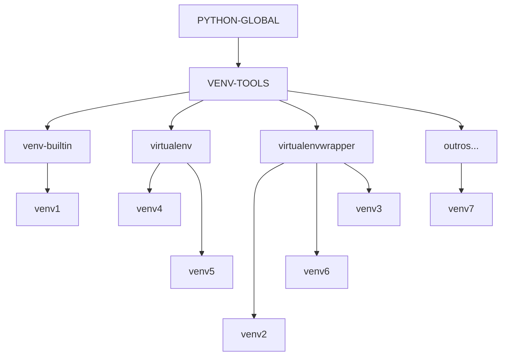

# Guia Rápido para Criação de Ambientes Virtuais e Estrutura de Projeto Python

## Introdução
Quando trabalhamos em projetos Python, é essencial manter um ambiente de desenvolvimento organizado e isolado. Neste guia, abordaremos como criar ambientes virtuais usando o `venv`, `virtualenv` ou `virtualenvwrapper` e como estruturar um projeto básico  para publicação no github.


## Criando um Ambiente Virtual com `venv`
O `venv` é um módulo integrado ao Python e permite criar ambientes virtuais de forma simples. Siga os passos abaixo:

1. **Abra um Terminal ou Prompt de Comando:**
   - Acesse o diretório raiz do seu projeto usando o comando `cd /caminho/do/seu/projeto`.

2. **Crie o Ambiente Virtual:**
   - Execute o seguinte comando para criar um ambiente virtual com o nome desejado (substitua `nome_do_ambiente` pelo nome que você escolher):
     ```
     python -m venv nome_do_ambiente
     ```

3. **Ative o Ambiente Virtual:**
   - Dependendo do seu sistema operacional:
     - No Windows:
       ```
       nome_do_ambiente\Scripts\activate
       ```
     - No macOS e Linux:
       ```
       source nome_do_ambiente/bin/activate
       ```
   - O ambiente virtual estará ativado quando você ver o nome dele no prompt do terminal.

4. **Desativando o Ambiente Virtual:**
   - Para retornar ao ambiente global do Python, digite:
     ```
     deactivate
     ```

## Criando um Ambiente Virtual com `virtualenv`

O `virtualenv` é uma ferramenta externa que oferece mais flexibilidade na criação de ambientes virtuais. Siga os passos abaixo:

1. **Instale o `virtualenv`:**
   - Execute o seguinte comando para instalar o `virtualenv`:
     ```
     pip install virtualenv
     ```

2. **Crie o Ambiente Virtual:**
   - Navegue até o diretório do seu projeto e execute:
     ```
     virtualenv nome_do_ambiente
     ```

3. **Ative e Desative o Ambiente Virtual:**
   - Para ativar o ambiente virtual:
     - No Windows:
       ```
       nome_do_ambiente\Scripts\activate
       ```
     - No macOS e Linux:
       ```
       source nome_do_ambiente/bin/activate
       ```
   - Para desativar o ambiente virtual:
     ```
     deactivate
     ```

4. **Listar Ambientes Virtuais:**
   - Para listar todos os ambientes virtuais criados:
     ```
     lsvirtualenv
     ```

5. **Remover um Ambiente Virtual:**
   - Para remover um ambiente virtual específico:
     ```
     rmvirtualenv nome_do_ambiente
     ```

## Criando um Ambiente Virtual com `virtualenvwrapper-win`

O `virtualenvwrapper-win` é uma alternativa para Windows. Ele simplifica a criação e gerenciamento de ambientes virtuais. Siga os passos abaixo:

1. **Instale o `virtualenvwrapper-win`:**
   - Execute o seguinte comando:
     ```
     pip install virtualenvwrapper-win
     ```

2. **Crie o Ambiente Virtual:**
   - Navegue até o diretório do seu projeto e execute:
     ```
     mkvirtualenv nome_do_ambiente
     ```

3. **Ative e Desative o Ambiente Virtual:**
   - Para ativar o ambiente virtual:
     ```
     workon nome_do_ambiente
     ```
   - Para desativar o ambiente virtual:
     ```
     deactivate
     ```

4. **Listar Ambientes Virtuais:**
   - Para listar todos os ambientes virtuais criados:
     ```
     workon
     ```

5. **Remover um Ambiente Virtual:**
   - Para remover um ambiente virtual específico:
     ```
     rmvirtualenv nome_do_ambiente
     ```

## Estrutura de Projeto Básico
Aqui está uma sugestão de estrutura para o seu projeto Python:
```
meu_projeto/
│   .env
│   .env-exemplo
│   .gitignore
│   main.py
│   LICENSE
│   README.md
│
└───.vscode/
│      settings.json
│   
└───meu_app/
│   │   __init__.py
│   │   app.py
│   │
│   └───utils/
│       │   __init__.py
│       │   helper.py
│
└───tests/
    │   test_app.py
```

- `.env`: Arquivo que permite isolar configurações e proteger informações confidenciais. (***ATENÇÃO***: o nome deste arquivo deve ser adicionado no .gitignore) 
- `.env-exemplo`: Arquivo com as variáveis de ambiente utilizadas apenas com valores fictícios atribuidos a elas. 
- `.gitignore`: Arquivo para ignorar arquivos e pastas no Git (inclua o ambiente virtual).
- `main.py`: Ponto de entrada do seu aplicativo.
- `LICENCE`: Licença do projeto.
- `README.md`: Documentação do projeto.
- `.vscode/`:  Pasta de configurações de projeto que se aplicam apenas ao ambiente de desenvolvimento do VSCode.
  - `settings.json`: O arquivo `settings.json` do Visual Studio Code (VSCode) contém configurações que afetam o comportamento do ambiente de desenvolvimento. No exemplo fornecido, são definidos padrões de exclusão para determinados tipos de arquivos no explorador de arquivos do VSCode.
- `meu_app/`: Pasta do seu aplicativo.
  - `__init__.py`: Arquivo para tornar a pasta um pacote Python.
  - `app.py`: Código principal do aplicativo.
  - `utils/`: Pasta para módulos auxiliares.
    - `__init__.py`: Arquivo para tornar a pasta um pacote Python.
    - `helper.py`: Funções auxiliares.
- `tests/`: Pasta para testes unitários.
  - `test_app.py`: Arquivo de testes.

## Conteúdo do settings.json:

```json
{ 
    "files.exclude": {
        "**/*.pyc": {"when": "$(basename).py"},
        "**/__pycache__": true,
        "**/*.pytest_cache": true
    }
}
```
### Atributos e suas funções:

1. **"files.exclude"**: Este atributo define padrões de exclusão para determinados tipos de arquivos. Quando configurado, o VSCode oculta automaticamente esses arquivos do explorador de arquivos.

2. **"**/*.pyc"**: Exclui arquivos com extensão `.pyc` (bytecode do Python) do explorador de arquivos. O parâmetro adicional `{"when": "$(basename).py"}` especifica que os arquivos `.pyc` serão excluídos apenas quando houver um arquivo correspondente com a extensão `.py`.

3. **"**/__pycache__"**: Exclui o diretório `__pycache__` do explorador de arquivos. Esse diretório é onde o Python armazena os arquivos de cache compilados.

4. **"**/*.pytest_cache"**: Exclui arquivos com a extensão `.pytest_cache` do explorador de arquivos. Esse diretório é onde o pytest armazena arquivos de cache.

Ao definir esses padrões de exclusão, é possível manter o ambiente de trabalho mais organizado, ocultando arquivos e diretórios que não são relevantes para o trabalho no momento.

## Considerações Finais
O uso de ambientes virtuais é fundamental para manter a organização e evitar conflitos de dependências em projetos Python. Este guia fornece os passos necessários para criar, ativar e usar um ambiente virtual com exemplos práticos.

Lembre-se de configurar um arquivo `.gitignore` para ignorar os arquivos do ambiente virtual ao versionar seu projeto no GitHub.

## Licença
Este projeto está licenciado sob a Licença MIT.

## Autor
McSilva - Código100Cera

## Contribuir
Sinta-se à vontade para fazer melhorias. PRs são muito apreciados.